# zimoarts

## Content Type Style

type 1

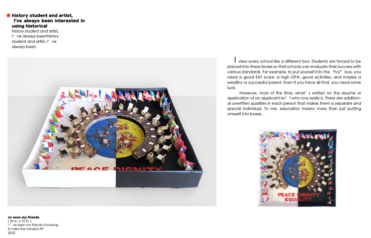

type 2

type 3

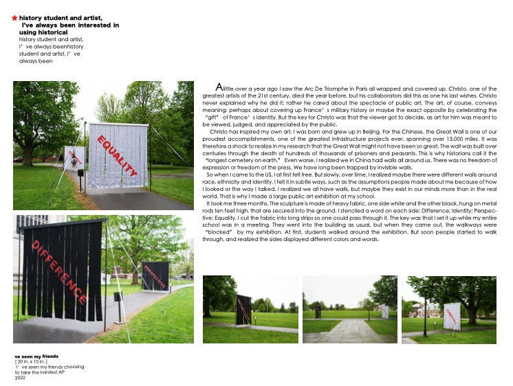

type 4

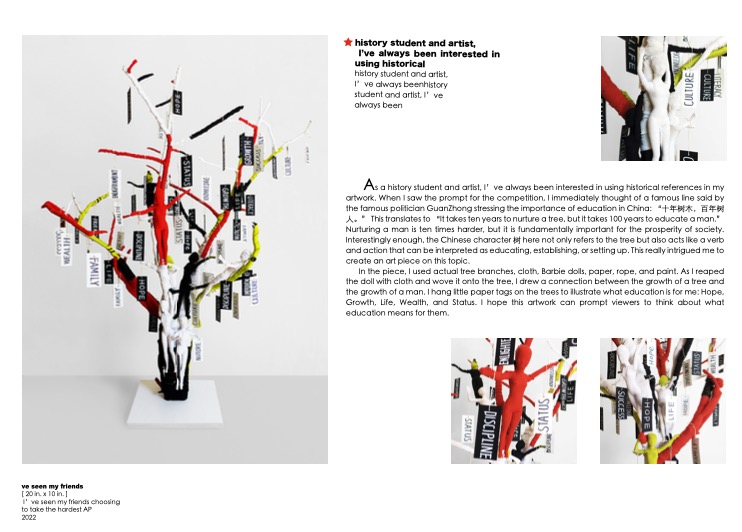

type 5

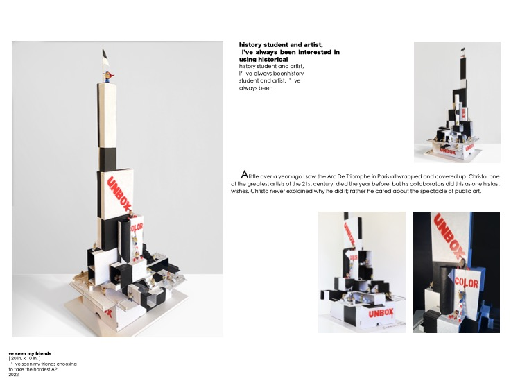

type 6

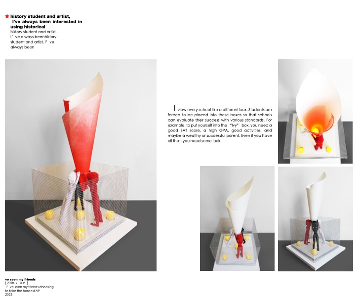

type 7

type 8

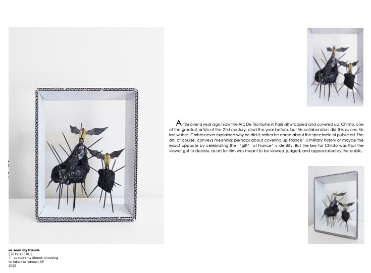

type 9

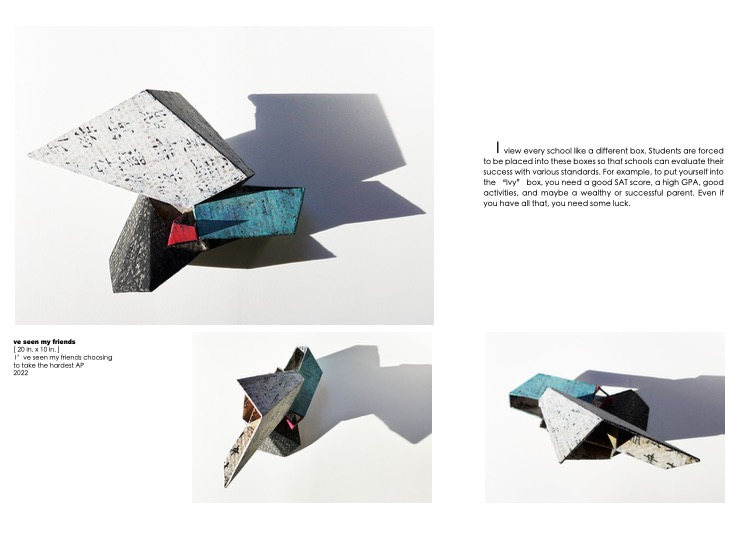

type 10

type 11

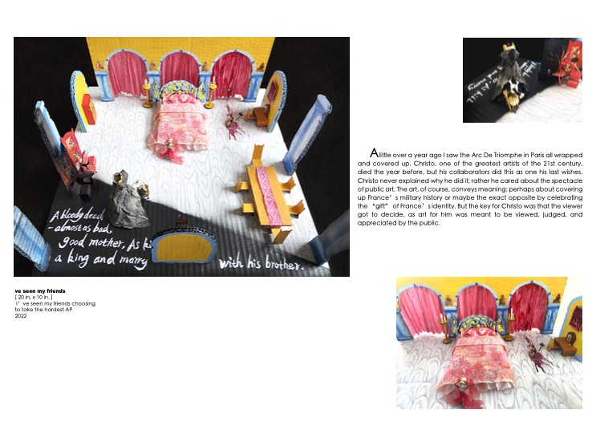

type 12

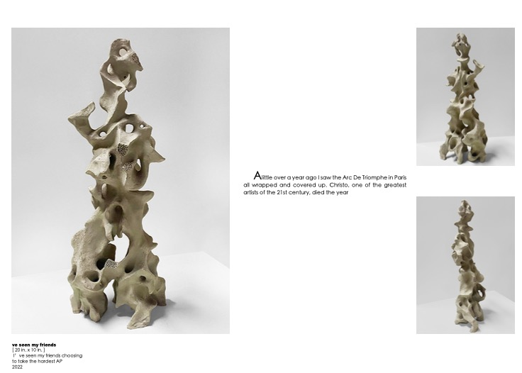

type 13

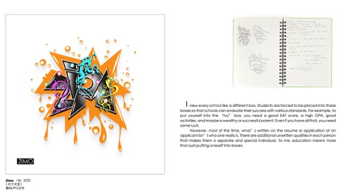

type 14

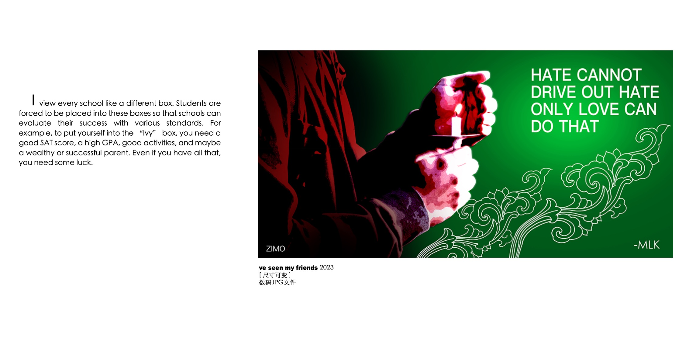

type 15

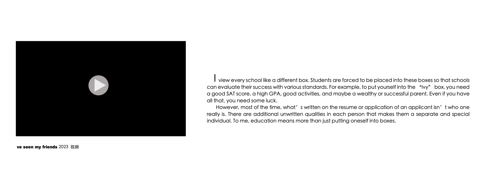

type 16

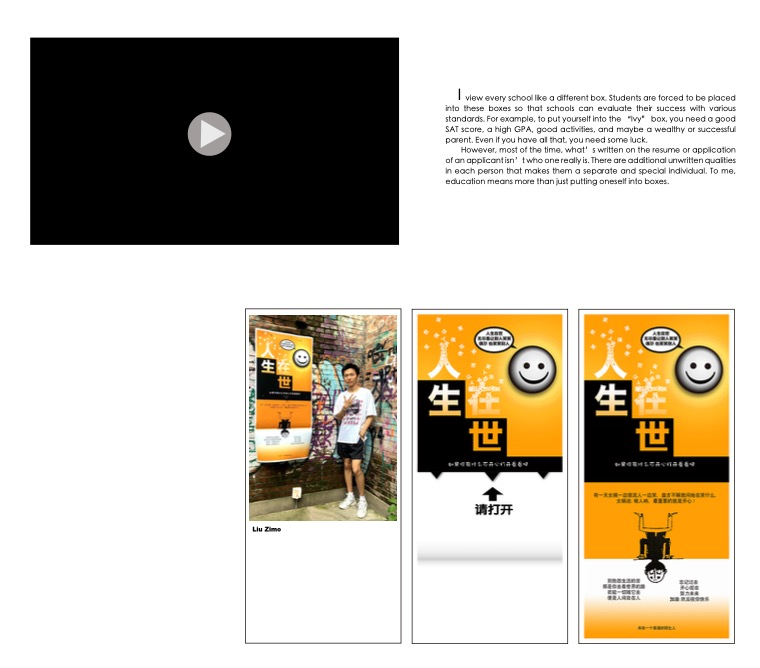

type 17

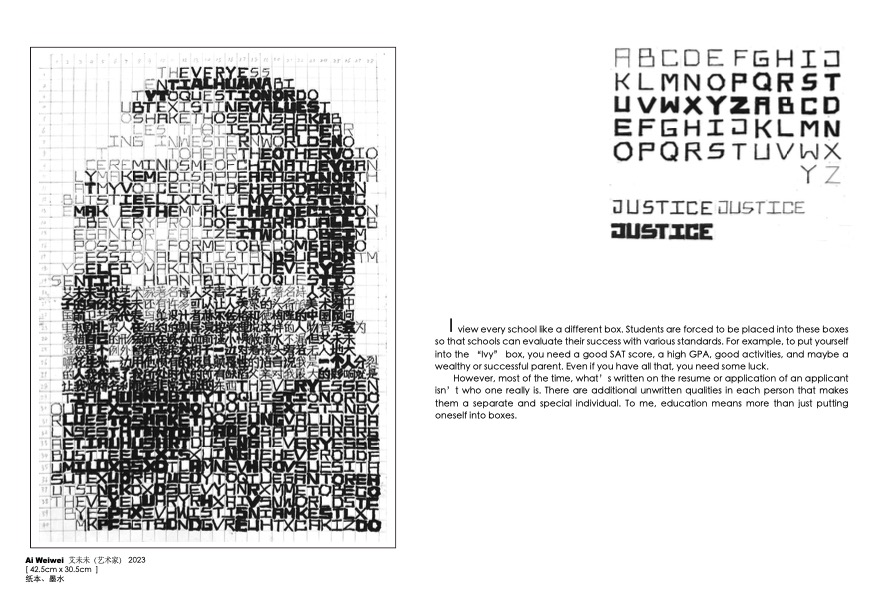

type 18

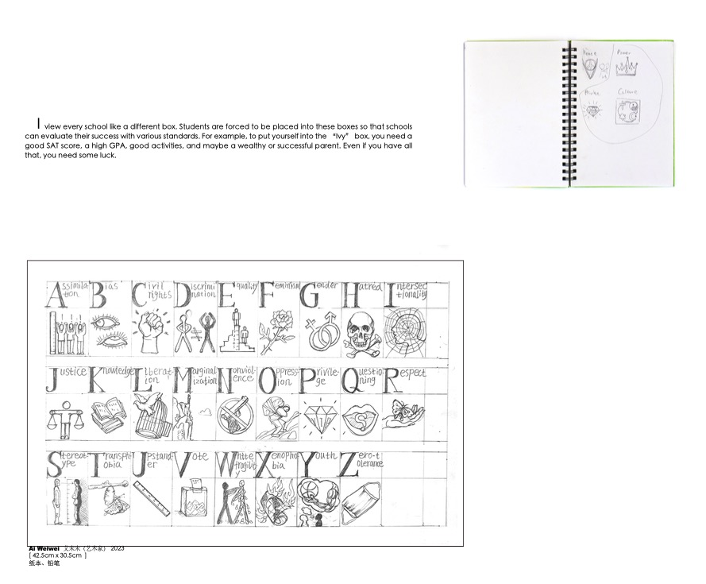

type 19

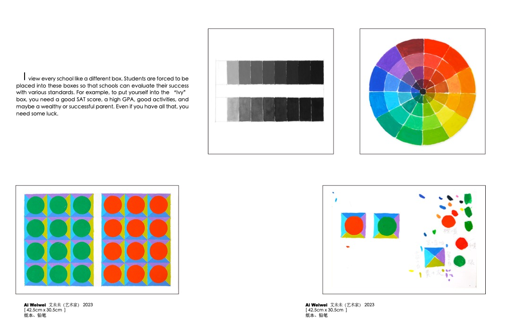

type 20

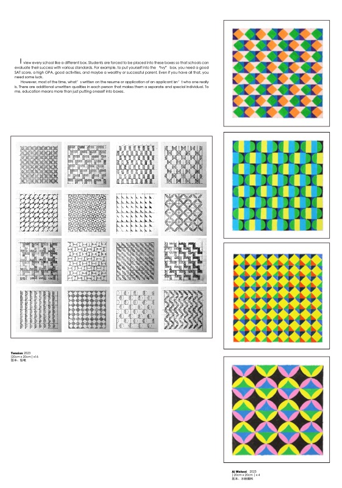

type 21

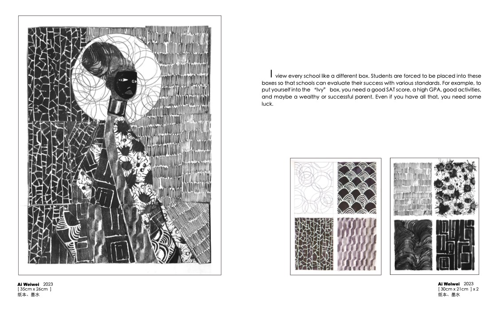

type 22

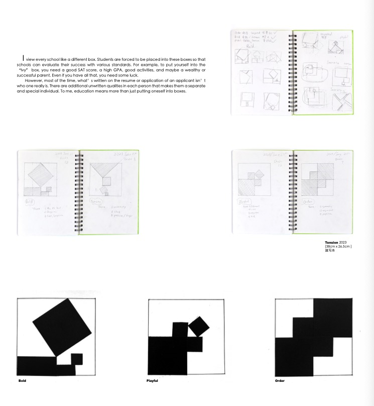

type 23

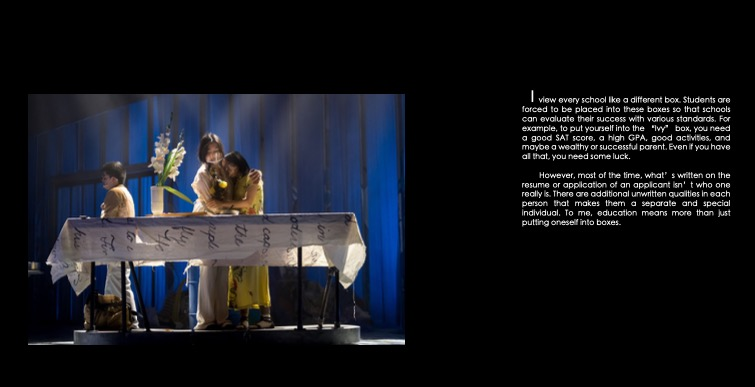

1 调航条!
2 照片变化特效
3 Sculpture page 最后三个 不要 但是前面所有的保留标题 和description!
4 photography 页面 标题和照片中间加description!
5 照片顺序按 我爸爸发的那个顺序调整一下
6 打开动画 按最开始的那个logo做
7 主页photography 滚动条照片
8 Sculputre 那个this decade description 字比其他的description要笑!
