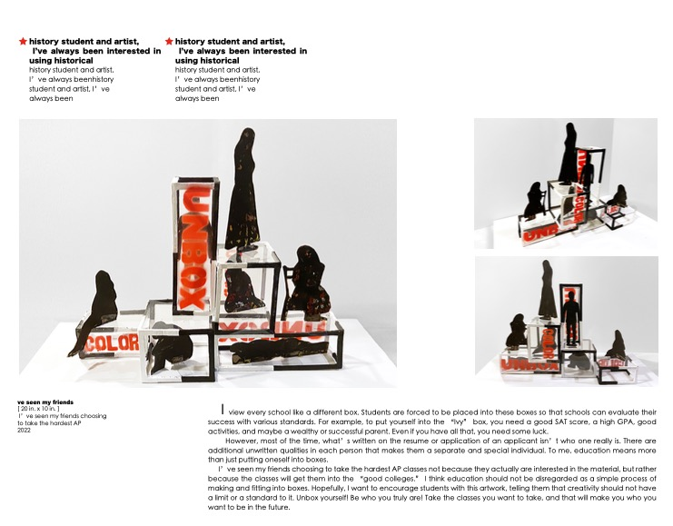

# zimoarts

## Content Type Style

type 1

type 2

type 3

type 4

type 5

type 6

type 7

type 8

type 9

type 10

type 11

type 12

type 13

type 14

type 15

type 16

type 17

type 18

type 19

type 20

type 21

type 22

type 23

1 调航条!
2 照片变化特效
3 Sculpture page 最后三个 不要 但是前面所有的保留标题 和description!
4 photography 页面 标题和照片中间加description!
5 照片顺序按 我爸爸发的那个顺序调整一下
6 打开动画 按最开始的那个logo做
7 主页photography 滚动条照片
8 Sculputre 那个this decade description 字比其他的description要笑!
